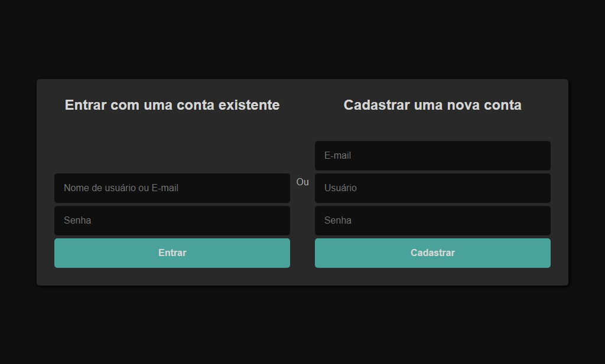

# Tela de login e registro

  <h2>Prints</h2>
  

- Frontend criado usando ReactJS(+bibliotecas adicionais) e SCSS;
- Backend criado usando NodeJS/Express para gerenciamento de rotas de login e cadastro, tratamento de dados, autenticação JWT(Json Web Token), senha HASH usando Bcrypt;
- Banco de dados MongoDB/Mongoose para armazenamento de dados dos usuários.
